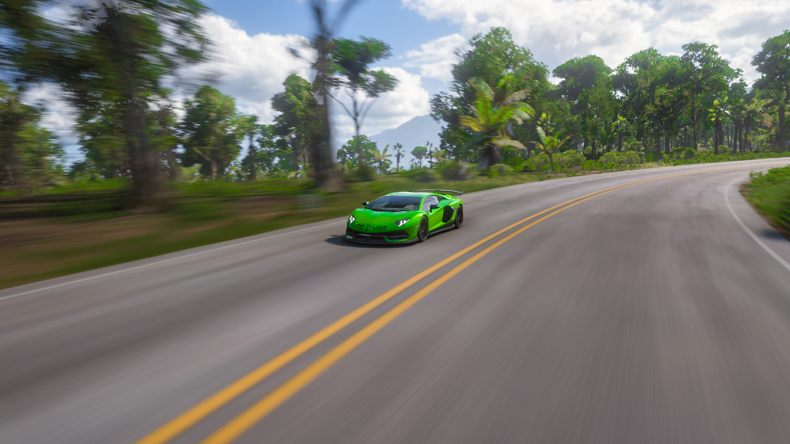
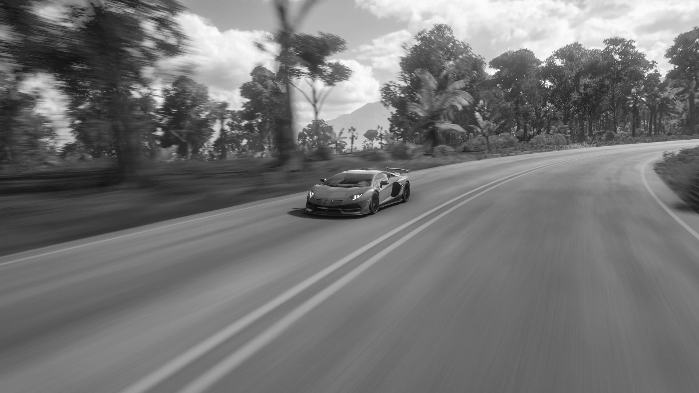
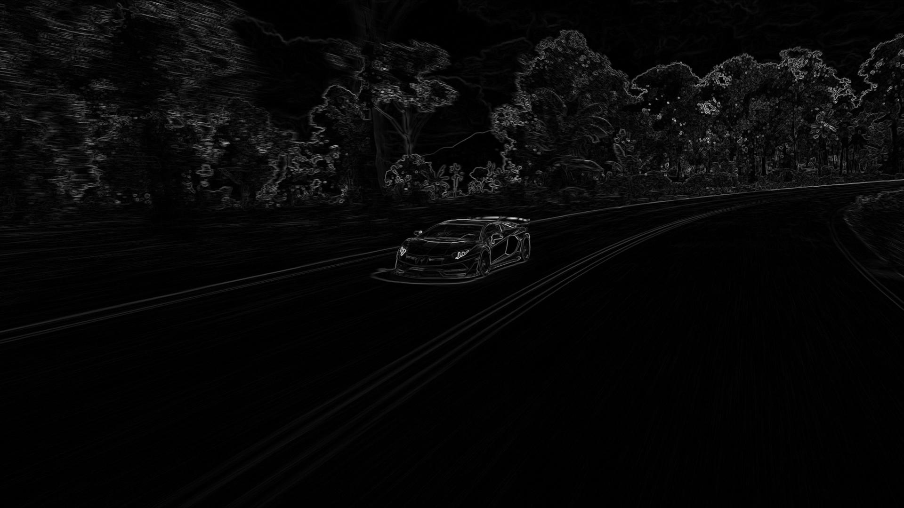

# 🧪 Filters Directory

This folder contains all the custom image filter implementations written from scratch using **NumPy**. The goal is to understand and implement basic digital signal processing (DSP) concepts manually — without relying on high-level image libraries like PIL or OpenCV.

## Directory Structure
```
 filters/
├── test_outputs/
├── audio_filters.py
├── brightness.py
├── contrast.py
├── edge_detection.py
├── grayscale.py
├── horizontal_flip.py
├── main.py
├── resize.py
├── sharpen.py
└── utils.py
```

## Image Filters

### Orginal Image

### 1. Grayscale Conversion
```python
from grayscale import grayscale
gray_img = grayscale(rgb_img)
```


### 2. Edge Detection
```
from edge_detection import sobel_edge_detection
edges = sobel_edge_detection(img)
```

